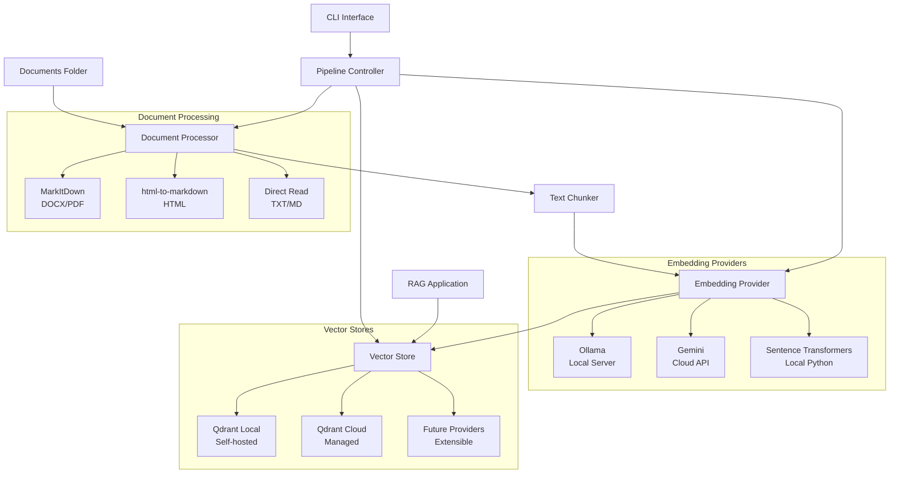

# Document Embeddings Pipeline

A production-ready, modular Python pipeline for building RAG (Retrieval-Augmented Generation) applications. Process documents, generate embeddings, and store them in vector databases with support for multiple embedding providers and deployment scenarios.

   

## 🎯 Perfect for RAG Applications

This pipeline serves as the **foundation for RAG systems**, handling the critical ingestion and vectorization phase that enables semantic search and context retrieval for AI applications.

**What it does:**

1. **Ingests** documents from multiple formats (.txt, .docx, .pdf, .md, .html)
2. **Processes** them into semantically meaningful chunks
3. **Generates embeddings** using your choice of providers
4. **Stores** in vector databases for fast similarity search
5. **Provides** APIs for RAG applications to query and retrieve context

## ✨ Key Features

### 🔄 **Multiple Embedding Providers**

- **Ollama** (Local server) - Self-hosted, privacy-focused
- **Google Gemini** (Cloud API) - High-quality, scalable
- **Sentence Transformers** (Local Python) - Lightweight, browser-compatible

### 📁 **Comprehensive Document Support**

- Text files (.txt, .md)
- Microsoft Word (.docx)
- PDF documents (.pdf)
- HTML pages (.html)
- Automatic markdown conversion for consistent processing

### 🗄️ **Flexible Vector Storage**

- **Qdrant Local** - Self-hosted for privacy
- **Qdrant Cloud** - Managed service for scalability
- Unified client interface for seamless switching

### 🛠️ **Developer Experience**

- Single configuration file with comprehensive examples
- Full CLI interface for all operations
- Comprehensive unit test coverage
- Type hints and detailed documentation

## 🏗️ Architecture



## 🚀 Quick Start

### Prerequisites

- **Python 3.8+**
- **Docker** (for local Qdrant) - [Install Docker Desktop](https://www.docker.com/products/docker-desktop/)
- **Choose your embedding provider:**
  - Ollama (local) - Install with `brew install ollama`
  - Gemini (cloud) - Get API key from [Google AI Studio](https://ai.google.dev/)
  - Sentence Transformers (local) - No external dependencies
- **Choose your vector database:**
  - Qdrant Local - Uses Docker (`docker pull qdrant/qdrant`)
  - Qdrant Cloud - Sign up at [cloud.qdrant.io](https://cloud.qdrant.io/)

### Installation

```bash
# Clone the repository
git clone https://github.com/able-wong/doc-embeddings-pipeline.git
cd doc-embeddings-pipeline

# Create virtual environment
python3 -m venv venv
source venv/bin/activate  # On Windows: venv\Scripts\activate

# Install dependencies
pip install -r requirements.txt

# Configure the pipeline
cp config.yaml.example config.yaml
# Edit config.yaml with your settings
```

### First Run

```bash
# Start your chosen services (if using local providers)
ollama serve                    # If using Ollama

# If using local Qdrant with Docker:
docker run -d --name qdrant \
    -p 6333:6333 -p 6334:6334 \
    -v $(pwd)/qdrant_storage:/qdrant/storage:z \
    qdrant/qdrant

# Test connections
python3 ingest.py test-connections

# Add documents to the ./documents folder, then
python3 ingest.py reindex-all

# Search your documents
python3 ingest.py search "your search query"
```

## 📖 Usage Examples

### Basic Operations

```bash
# Test all connections
python3 ingest.py test-connections

# Process all documents in ./documents folder
python3 ingest.py reindex-all

# Add or update a specific document
python3 ingest.py add-update path/to/document.pdf

# Search documents (returns detailed results)
python3 ingest.py search "machine learning algorithms" --limit 5

# RAG-formatted search (optimized for AI consumption)
python3 ingest.py search-rag "explain neural networks" --limit 3

# View collection statistics
python3 ingest.py stats

# List all indexed documents
python3 ingest.py list-documents
```

### Provider Switching

```bash
# Use Sentence Transformers (fastest setup)
# Edit config.yaml: set provider: "sentence_transformers"
python3 ingest.py test-connections

# Use Ollama with specific model
# Edit config.yaml: set provider: "ollama", model: "nomic-embed-text"
python3 ingest.py test-connections

# Use Gemini (requires API key)
export GEMINI_API_KEY="your-api-key"
# Edit config.yaml: set provider: "gemini"
python3 ingest.py test-connections
```

## 🔧 Configuration

The pipeline uses a single configuration file with comprehensive examples:

### Key Configuration Sections

```yaml
# Embedding provider selection
embedding:
  provider: "sentence_transformers"  # or "ollama" or "gemini"
  
  sentence_transformers:
    model: "all-MiniLM-L6-v2"        # 384D, ~90MB, browser-compatible
    device: "cpu"                    # or "cuda", "mps"

# Vector database selection  
vector_db:
  provider: "qdrant"
  host: "localhost"                  # For local Qdrant
  # url: "https://..."               # For Qdrant Cloud
  collection_name: "documents"
```

### Environment Variables

```bash
# API keys (recommended approach)
export GEMINI_API_KEY="your-gemini-key"
export QDRANT_API_KEY="your-qdrant-key"
```

## 🔌 Integration with RAG Applications

### TypeScript/JavaScript Integration

```typescript
// Connect to your Qdrant instance
import { QdrantClient } from '@qdrant/js-client-rest';

const client = new QdrantClient({
  url: 'http://localhost:6333',
});

// Search for relevant context
const results = await client.search('documents', {
  vector: queryEmbedding,
  limit: 5,
  with_payload: true,
});
```

### Python Integration

```python
from qdrant_client import QdrantClient

client = QdrantClient("localhost", port=6333)
results = client.search(
    collection_name="documents",
    query_vector=query_embedding,
    limit=5,
    with_payload=True
)
```

### REST API Integration

```bash
curl -X POST "http://localhost:6333/collections/documents/points/search" \
  -H "Content-Type: application/json" \
  -d '{
    "vector": [0.1, 0.2, 0.3, ...],
    "limit": 5,
    "with_payload": true
  }'
```

## 🎭 Embedding Model Comparison

| Provider | Model | Dimensions | Size | Best For |
|----------|-------|------------|------|----------|
| Ollama | `nomic-embed-text` | 768 | 274MB | Local privacy |
| Gemini | `text-embedding-004` | 768 | API | High quality |
| Sentence Transformers | `all-MiniLM-L6-v2` | 384 | 90MB | Speed & browser compatibility |
| Sentence Transformers | `all-mpnet-base-v2` | 768 | 420MB | Best quality local |

## 🧪 Testing

```bash
# Run all tests
pytest

# Run with coverage
pytest --cov=src

# Run specific provider tests
pytest tests/test_embedding_providers.py -v

# Test specific functionality
pytest tests/test_vector_stores.py::test_create_collection_success -v
```

## 🛡️ Production Deployment

### Security Best Practices

- ✅ API keys via environment variables
- ✅ `config.yaml` in `.gitignore`
- ✅ No hardcoded credentials
- ✅ Configurable timeouts and retries

### Scalability Considerations

- **Batch Processing**: Sentence Transformers supports batch embedding generation
- **Vector Storage**: Qdrant Cloud auto-scales
- **Memory Management**: Chunking prevents memory issues with large documents
- **Connection Pooling**: Qdrant client handles connection efficiency

### Monitoring

```bash
# Check collection health
python3 ingest.py stats

# Verify embeddings quality
python3 ingest.py search "test query" --limit 1

# Monitor processing logs
python3 ingest.py reindex-all  # Check logs for performance metrics
```

## 🔧 Extension & Customization

### Adding New Embedding Providers

1. Create a class inheriting from `EmbeddingProvider`
2. Implement required methods: `generate_embedding`, `test_connection`, etc.
3. Update the factory function in `embedding_providers.py`
4. Add configuration options

### Adding New Vector Stores

1. Create a class inheriting from `VectorStore`
2. Implement all abstract methods
3. Update the factory function in `vector_stores.py`
4. Add configuration support

### Custom Document Processing

1. Add new extensions to `supported_extensions` in config
2. Implement extraction logic in `DocumentProcessor`
3. Ensure output is clean markdown format

## 📋 Requirements

**System Requirements:**

- Python 3.8+
- Docker Desktop (for local Qdrant)
- 4GB+ RAM recommended
- 1GB+ disk space for models

**Dependencies:**

- Core: `requests`, `pydantic`, `click`, `pyyaml`
- Document processing: `markitdown`, `pypdf`, `html-to-markdown`
- Embeddings: `google-generativeai`, `sentence-transformers`
- Vector storage: `qdrant-client`
- Testing: `pytest`, `pytest-mock`

## 🤝 Contributing

1. Fork the repository
2. Create a feature branch (`git checkout -b feature/amazing-feature`)
3. Make your changes with tests
4. Run the test suite (`pytest`)
5. Commit your changes (`git commit -m 'Add amazing feature'`)
6. Push to the branch (`git push origin feature/amazing-feature`)
7. Open a Pull Request

## 📄 License

This project is licensed under the MIT License - see the [LICENSE](LICENSE) file for details.

---

⭐ **Star this repo if it helped you build better RAG applications!**

For questions and support, please open an issue or check the [documentation](https://github.com/able-wong/doc-embeddings-pipeline/wiki).
